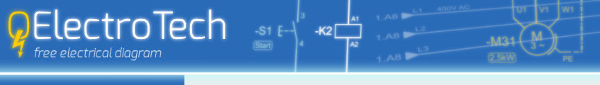

# QElectroTech

### What it is

QElectroTech, or QET in short, is a libre and open source desktop application to create diagrams and schematics.  
The software is primarily intended to create electrical documentation but it can also be used to draw any kinds of diagrams, such as those made in pneumatics, hydraulics, process industries, electronics...  
Generally speaking, QET is a **CAD/CAE editor focusing on schematics drawing features**.  

This means that there are no embedded simulating or calculating functionalities and it is not planned to implement them.

The main goal of the developers is to provide a libre, easy to use and effective software for **schematics drawing purposes**.

### Version

The current stable version is 0.90 and was released on 2023.01.06.
Once it has been officially released, the stable version is always frozen and is no longer developed.

New functionalities, bug and issue fixings are further made in the development version (currently 0.100), which can also be [downloaded](https://qelectrotech.org/download.php).

Users who want to test and take benefits from the last software implementations should use the development version. But... use it at your own risk, since things are sometimes broken or only partially implemented until they are done!

### License

The software is licensed under [GNU/GPL](https://www.gnu.org/licenses/old-licenses/gpl-2.0.en.html).  
You are free to use, copy, modify and redistribute it under the terms of the license.

Like many other open source software, QElectroTech is provided as is, without any warranty.

### Development / technical choices

The development follows the classical way of free and open source software: the source code, written by a community of users, is freely accessible.
*    Get sources and sub-modules
```txt
git clone --recursive https://github.com/qelectrotech/qelectrotech-source-mirror.git
```

Here are the technical choices made for the software development:

*   Integrated development environment: [Qt Framework](https://www.qt.io/ide/)
*   Libraries: Qt 5.x
*   [KF5 Framework](https://github.com/KDE)  
    [Cmake](https://cmake.org/install/)   
    [kcoreaddons](https://github.com/KDE/kcoreaddons/tree/kf5)   
    [kwidgetsaddons](https://github.com/KDE/kwidgetsaddons/tree/kf5).  
*   Coding language: [C++](https://en.wikipedia.org/wiki/C%2B%2B)
*   GUI translations: [Qt Linguist](http://doc.qt.io/qt-5/qtlinguist-index.html)
*   Version control: [GIT](https://github.com/qelectrotech/qelectrotech-source-mirror.git)
*   Doxygen documentation :[Doxygen](https://download.qelectrotech.org/qet/doxygen/html/)
*   QtCreator qch doxygen :[QElectroTech.qch](https://download.qelectrotech.org/qet/doxygen/)
*   File format for projects, elements and titleblocks: [XML](http://www.w3schools.com/xml/xml_whatis.asp)
*   Main development platform: [GNU/Linux](http://getgnulinux.org/en/linux/)
*   Targeted platforms: Windows, GNU/Linux, Mac OS X, BSDs
*   [Forum](https://qelectrotech.org/forum/index.php)
*   [Wiki](https://qelectrotech.org/wiki_new/)
*   [Mantis_bugtracker](https://qelectrotech.org/bugtracker/my_view_page.php)

If you wish to be informed of the latest developments, browse the [archive](https://listengine.tuxfamily.org/lists.tuxfamily.org/qet/) of the project mailing list where all commits (changes) are registered. This archive is publicly available, you don't need any account to access it.


# Features

QElectroTech is a free and open source software.  
No need to worry about restrictive licensing, privacy violation or dependency on a company.  
Zero cost and no licensing fees!  
But you are welcome to make a donation to support the development

QElectroTech runs on the 3 most widespread operating systems for desktop computers in the world.  
Files that were created on an OS can be edited on another OS without any conversion or restriction.  
MS Windows users can even run the "ready-to-use" version of QElectroTech from an external medium with no need to install it on an access restricted computer.


Take advantage of the modern GUI

Toolbars and panels can be enabled/disabled, moved and displayed the way you want to work.  
Panels can be stacked on each other (as tabs) or docked on the sides (as docks) or completely separated from the main window (as windows).  
The GUI can fit to small or big screens, and even to multi-display configurations.


The GUI of QElectroTech is translated in 25 languages.
You only need to restart the application for the new selected language to take effect.


Create technical documentation in professional quality

Size, look and informations of the folios (sheets) are fully configurable.  
You can set vertical and horizontal headers (printed rulers) individually on and off, set number of columns and rows, and set width/height of each column/row.

Titlebocks can be created and edited with the embedded titleblock editor to perfectly suit your needs.  
Custom variables can be defined to display the informations you wish in the titleblock.


With only 2 mouse clicks you can add a full automatic generated table of content.  
Changes in the documentation are updated on the fly.


Choose from more than 8.200 symbols...
The embedded QET collection contains a rich library of electric, logic, pneumatic, hydraulic and fluid symbols.  
The library grows at every new release thanks to an active user community.


...or create your own collection

The embedded element editor is a nice tool to create your own elements (symbols or anything else).  
Your own elements are stored in the user collection.


Quickly find what you need

All collections can quickly be searched with the integrated search engine.  
Furthermore, the search request can be restricted to the folder of your choice.


Easily draw complex schematics

To add an element on the drawing area, it only needs a drag & drop from the collection panel.


Elements are automatically connected if they are aligned, or connected from point to point by pulling a conductor with the mouse.


The path of every conductor can be modified by moving its handles with the mouse.

And of course, you can accurately zoom with the mouse wheel over the drawing area to catch the smallest details.

Link elements together to create cross references

Several types of element can be linked together to display a cross reference text.  
All types of cross references are automatically updated on the fly, you don't need to think about them if you make changes.

To speed up your work, linkable elements are easily searched and shown.


Export informations to a parts list
Informations of all elements in the project can be exported to a .csv file that can be read and edited by any spreadsheet application.


This way, you can make your own parts list or bill of material using the full power of a spreadsheet program.

Print to pdf and/or export your work to images

Your whole documentation or only selected parts of it can be printed to a real printer or to a pdf file.  
Alternatively, you can export to vector (svg) or pixel (png, jpg, bmp) format images.

### And much more:

*   open and edit several projects at the same time
*   import images (.bmp, .jpg, .png, .svg) in your diagrams
*   add basic shapes (lines, rectangles, ellipses, polygons) to your drawings
*   edit the thickness, the line style and the color of conductors
*   define some autonum patterns for conductors, symbols and folios
*   take advantage of the open xml standard of elements and projects to create custom tools
*   search and replace Widget (Ctrl + F) in entire project
*   conductors num can be exported to csv file.
*   ***

Nomenclature

A new nomenclature tool appears in the menu: project -> Add a nomenclature.
The nomenclature is presented in the form of a configurable table separated into two parts: the display (the form) and the content (the background).  
- Display: the size and position of the table, the margins between text and the table cell, the alignment of the text in the cells and the font. The configuration of the table headers and the table itself are separate.  
- Content: the information to display in the table and the order in which it should be displayed.  


In order to speed up the establishment of a nomenclature, it is possible to export / import the display and content configurations separately. This is the "Configuration" part that can be seen in the photos above.  

Behind the scenes, an SQLite database does the work, so setting up the content is nothing more or less than an SQL query created using a dialog (screenshot by right).  
The SQL query is configured as follows (from top to bottom in the screenshot):  
- “Available information”: the information to display;  
- "Filter": filter the information (is not empty, is empty, contains, does not contain, is equal to, is not equal to) only one filter can be applied per information, it is not possible combine several;  
- "Type of elements": allows you to filter on what type of element you want to obtain information.  

At the bottom, a checkmark "SQL query" allows you to edit a personalized query, if the basic options are not sufficient.  

When a nomenclature is too large to be contained in a single folio, it is possible to separate it on several folios, the tables of each folio are then linked together. When creating a nomenclature, this option is activated by default, which has the effect of adding the necessary number of folios, adding a table in each of them and linking them together.  

Finally two buttons are available in the property panel:    
- "Fit the table to the folio": positions and adjusts the size and determines the number of rows in the table in relation to the folio;  
- "Apply geometry to all tables linked to this one": applies the three properties mentioned above to all linked tables in order to save time and maintain aesthetic consistency.  

And to finish a table   


Summary

The old summary has been completely removed from the code in order to make room for the new one which is exactly the same as the nomenclature (a large amount of the code is common), with the exception of the SQL query (and its dialog to configure it) which offers specific information for editing a summary.  

Export of the internal database  

The database used by the nomenclature and the summary can be exported in a “.sqlite” file.  
Currently this is irrelevant, as the function was created during development for debugging purposes, we left it.  
Note that the database will become increasingly important in the future of Qet.  


Export of the wiring list  

In order to be able to use the wiring number printers more easily, the names of conductors can be exported in CSV format, the export respects the quantity of conductors in order to print the right quantity of numbers, for example a potential numbered 240 composed of 3 wires will give 6 × 240 (2 numbers per wire × 3 wires) in the CSV. 


### Story

The QElectroTech project was founded in 2007 by two french students, Xavier and Benoit.  
Xavier developed the base application itself and made all technical choices about the development.  
The first version of QET (0.1) was released on 09.03.2008.  
However, both Xavier and Benoit do not participate anymore in the project since 2013.

Following this period, new developers and contributors took over the project and kept it alive.  
The development and the many translations are actively maintained.  
New functionalities and evolutions are planned to make QET ever better.

Nowadays, QET is not only used by many individuals, teachers and students but also by professional electricians and companies all over the world.

  
### Donate Money

If you love QElectroTech, you can help developers to buy new hardware to test
and implement new features. Thanks in advance for your generous donations.

For more information, look at [Paypal](https://www.paypal.com/donate/?cmd=_s-xclick&hosted_button_id=ZZHC9D7C3MDPC&ssrt=1694606609672)


