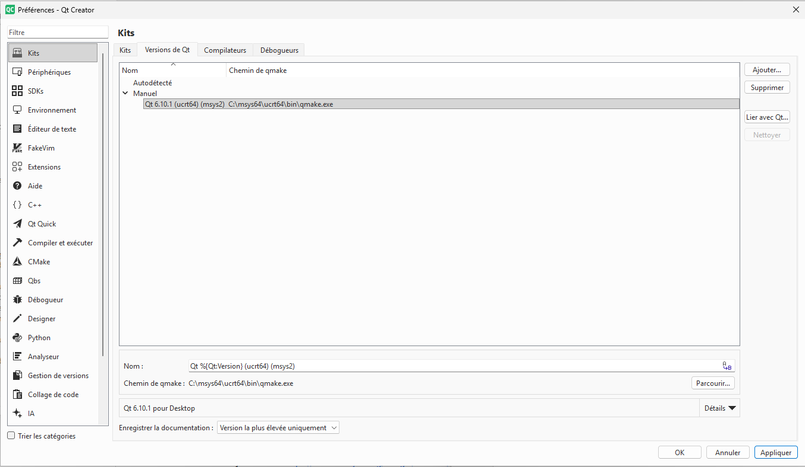
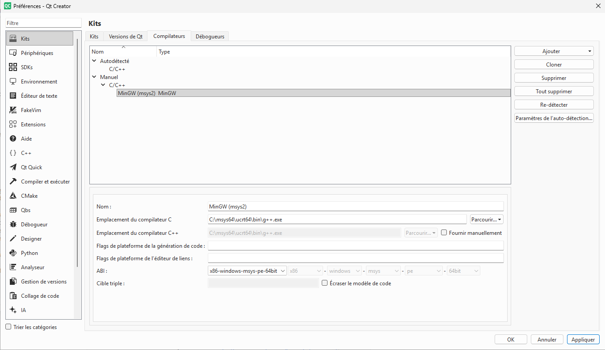
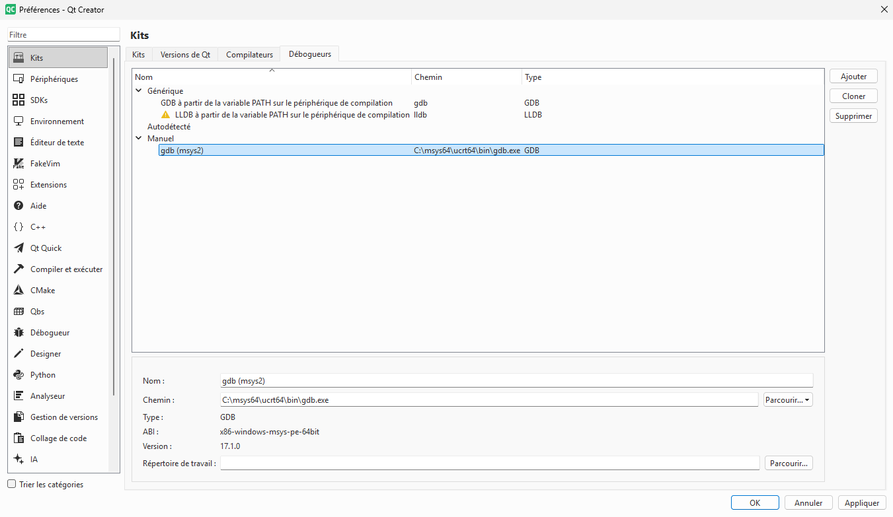
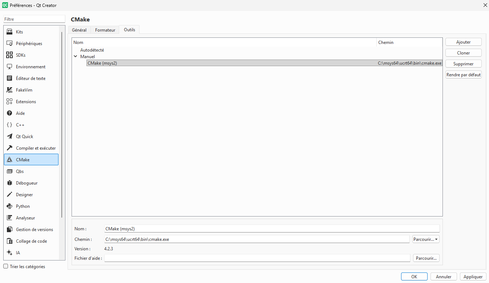
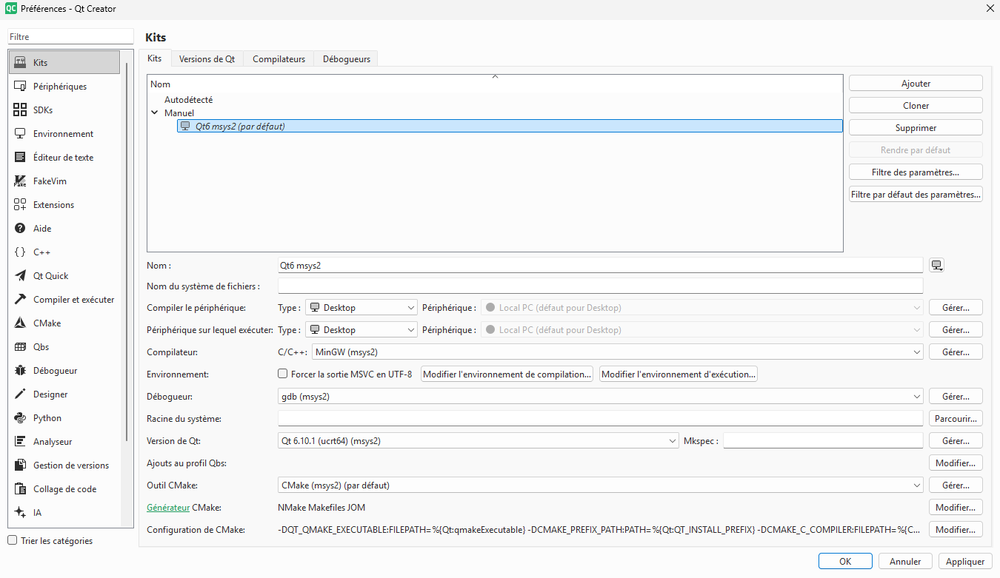

Compiler QElectroTech sous microsoft Windows 10 et 11 avec MSYS2
================================
Ce document décrit les étapes nécessaire afin de compilé QElectroTech sous Windows avec Qt6 et cmake en utilisant MSYS2.

# MSYS2
L'ensemble des outils nécessaire au développement et à la compilation de QElectroTech sous Windows sera installé par l’intermédiaire de [MSYS2](https://www.msys2.org/). Cela comprend entre autre le framework [Qt6](https://www.qt.io/development/qt-framework/qt6), les outils cmake, les dépendances ([kde framework](https://develop.kde.org/docs/), [sqlite](https://sqlite.org/), [pugixml](https://pugixml.org/)), les outils de compilation [minGW](https://www.mingw-w64.org/)...

>Il sera nécessaire d'utiliser [winget](https://learn.microsoft.com/fr-fr/windows/package-manager/winget/), celui-ci est présent par défaut sous Windows 11, dans le cas de Windows 10, winget peut necessité d'être activé manuellement

# Installer GIT et MSYS2 avec winget
Avec power shell.
```
winget install Git.Git
```
puis
```
winget install MSYS2.MSYS2
```


## Mise à jour de MSYS2
Lors de la première utilisation de MSYS2 il est nécessaire de mettre celui-ci à jour.

Lancer "MSYS2 MSYS" depuis le menu démarré de Windows.
Une fenêtre avec un shell s'ouvre, dans celui-ci lancer la commande :
```
pacman -Syu
```
A la fin de la mise à jour MSYS2 MSYS se fermera automatiquement. Ouvrez le à nouveau et relancé la commande
```
pacman -Syu
```

## Installation des outils de devellopement
Toujours dans le shell MSYS2 MSYS lancer la commande suivante.
```
pacman -S mingw-w64-ucrt-x86_64-gcc mingw-w64-ucrt-x86_64-cmake mingw-w64-ucrt-x86_64-qt6-svg mingw-w64-ucrt-x86_64-qt6-base mingw-w64-ucrt-x86_64-sqlite3 mingw-w64-ucrt-x86_64-pugixml mingw-w64-ucrt-x86_64-kcoreaddons mingw-w64-ucrt-x86_64-kwidgetsaddons mingw-w64-ucrt-x86_64-extra-cmake-modules mingw-w64-ucrt-x86_64-gdb mingw-w64-ucrt-x86_64-qt6-translations mingw-w64-ucrt-x86_64-qt6-tools
```
> La quantité de paquets à installer est conséquent, en fonction de votre connexion internet cela peut prendre plusieurs dizaine de minute

L'ensemble des outils est mantenant installé 😀

# Installer Qt creator
Télécharger [l'installateur online de Qt](https://www.qt.io/development/download-qt-installer-oss) et lancer l'installation en suivant les indications de ce dernier.

>Dans le cas où vous comptez utilisé Qt Creator uniquement pour développez QElectroTech, lors de l'installation choisissez l'option "installation personnalisée" puis dans la page suivante sélectionné uniquement Qt Creator.

## Configurer Qt creator
Ouvrir Qt creator puis rendez vous dans "édition -> préférence -> kit"

### Versions de Qt

- Cliquer sur _ajouter_
- Renseigner _Chemin de qmake_ (exemple C:\\msys64\\ucrt64\\bin\\qmake.exe).
- Dans le champ _Nom :_ ajouter (msys2).



### Compilateurs
- Cliquer sur _ajouter_ puis choisir _MinGW_.
- Renseigner _Emplacement du compilateur C_ (exemple C:\\msys64\\ucrt64\\bin\\g++.exe).
- Dans le champ _Nom :_ ajouter (msys2).



### Débogueurs
- Cliquer sur _ajouter_
- Renseigner  _Chemin :_ (exemple C:\\msys64\\ucrt64\\bin\\gdb.exe).
- Dans le champ _Nom :_ ajouter (msys2).



### cmake
- Outils -> _Ajouter_
- Renseigner  _Chemin :_ (exemple C:\\msys64\\ucrt64\\bin\\cmake.exe).
- Dans le champ _Nom :_ ajouter (msys2).



### KIT
Maintenant que tous les prérequis sont fait nous allons crée un kit utilisant les outils fournis par MSYS2. Cliquer sur _Ajouter_, un nouveau kit _manuel_ apparaît, nommer celui-ci par exemple _Qt6 msys2_ puis renseigner le compilateur, le débogueur, la version de Qt et Outils CMake en choisissant à chaque fois ceux que nous venons de créer.
puis cliquer sur _appliquer_.



Bravo 🥳🥳 vous avez terminé l'installation de la totalité des outils de développement.

# Clonez le dépôts de QElectrotech
Clonez le dépôt de QElectroTech comme vous le faite habituellement, sinon utilisez les commandes suivante dans power shell.

Crée et/ou se rendre dans le dossier dans lequel vous voulez clonez le dépôt (dans l'exemple nous allons crée un dossier QElectroTech dans C:)

```
mkdir C:\QElectroTech
cd C:\QElectroTech

git clone --recursive https://github.com/qelectrotech/qelectrotech-source-mirror.git
```

Une fois le dépôt cloné lancer Qt creator puis choisir d'ouvrir un projet existant, en choisissant le _CMakeLists.txt_ se trouvant à la racine du projet QElectroTech, enfin dans l'assistant de création de projet choisir comme kit le kit que nous avons créer précédemment.
